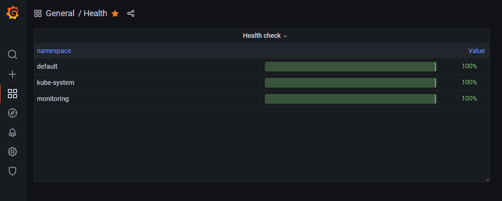

# Comportamento do liveness probe e readiness probe no Kubernetes

Validar o comportamento do liveness probe e readiness probe, do Kubernetes, em conjunto com as bibliotecas de verificação de integridade do .NET.

## Pré requisitos

Para realizar a POC é preciso atender os seguintes pré requisitos:
 - VSCode;
 - Dotnet versão 6.0;
 - Docker;
 - [HELM](https://helm.sh/docs/intro/install/);
 - [AKS com kubectl configurado](https://docs.microsoft.com/pt-br/azure/aks/kubernetes-walkthrough);
 - [Container registry configurado com o AKS](https://docs.microsoft.com/en-us/azure/aks/cluster-container-registry-integration?tabs=azure-cli).

## Configurando o ambiente

Antes de configurar o ambiente, precisamos criar e publicar a imagem do `Dockerfile` no container registry do AKS. Depois desta publicação, substitua o endereço da imagem, no arquivo `deployment.yml`, e aplique a alteração:

```ps1
> kubectl apply -f deployment.yml
```

Isso fará com que sejam criadas duas replicas do serviço em pods diferentes.
Após alguns instantes é possível verificar os pods em execução:

```ps1
> kubectl get pods
NAME                             READY   STATUS    RESTARTS   AGE
akshealthtest-5694dc4b46-4hl99   1/1     Running   0          6h32m
akshealthtest-5694dc4b46-zbkzq   1/1     Running   0          6h33m
```

Para acessar o serviço, precisamos configurar o load balancer com o seguinte comando:

```ps1
> kubectl apply -f service.yml
```

Podemos consultar o resultado para obter o IP externo.

```ps1
> kubectl get services
NAME            TYPE           CLUSTER-IP    EXTERNAL-IP    PORT(S)          AGE
akshealthtest   LoadBalancer   10.0.13.223   13.86.231.58   5000:32121/TCP   30h
```

Ao acessar o endpoint, o serviço irá retornar com o nome do pod que está executando:

```ps1
> curl http://13.86.231.58:5000/Machine
akshealthtest-5694dc4b46-4hl99
```

## Dinâmica dos testes

Foram criados dois endpoints `/health/live` e `/health/ready`, ambos retornam `Unhealthy` caso o arquivo `/tmp/live-error.txt` ou `/tmp/ready-error.txt` tenham sido criados.

Também foi realizada a configuração dos probes no kubernetes, conforme abaixo, para que as rotinas sejam disparadas ao primeiro sinal de erro:

```yml
livenessProbe:
    httpGet:
        path: /health/live
        port: 5000
    initialDelaySeconds: 5
    timeoutSeconds: 3
    periodSeconds: 10
    failureThreshold: 1
    readinessProbe:
    httpGet:
        path: /health/ready
        port: 5000
    initialDelaySeconds: 5
    timeoutSeconds: 3
    periodSeconds: 10
    failureThreshold: 1
```

Para criação dos arquivos, será executado o bash no pod.

```ps1
> kubectl exec -it --namespace develop pod-name bash
$ echo bla > /tmp/live-error.txt
```

## Cenários

Para o cenário onde o live probe foi configurado como `Unhealth`, o kubernetes automaticamente reinicia o pod, este cenário era esperado pois consta na documentação.

Quando o ready probe retorna `Unhealth` o kuberntess mantem a execução do pod e sinaliza como not ready (isso pode ser evidenciado pelo comando `kubectl get pods`). Neste cenário, esperava-se que novas requisições fossem encaminhadas para outro pod, porém não foi o que ocorreu. Isso é visível através do endpoint do serviço.

## Painel de monitoramento

Na última parte da POC, verificou-se a possibilidade de criação de um painel de monitoramento dos serviços pelo Grafana. Para isso, foi feita a configuração do Prometheus/Grafana através do tutorial [Monitor AKS Infrastructure using Prometheus and Grafana](https://myownpicloud.wordpress.com/2021/02/23/monitor-aks-infrastructure-using-prometheus-and-grafana/).

Criou-se também um painel, utilizando a query abaixo, para obter o percentual de pods com status ready por namespace.

```pomql
(sum by (namespace) (kube_pod_status_ready{condition="true"})) / (sum by (namespace) (kube_pod_info)) * 100
```

Esta query gerou o seguinte dashboard:




# Referências

[Configure Liveness, Readiness and Startup Probes](https://kubernetes.io/docs/tasks/configure-pod-container/configure-liveness-readiness-startup-probes/)

[Verificações de integridade no ASP.NET Core](https://docs.microsoft.com/pt-br/aspnet/core/host-and-deploy/health-checks?view=aspnetcore-6.0)

[Monitor AKS Infrastructure using Prometheus and Grafana](https://myownpicloud.wordpress.com/2021/02/23/monitor-aks-infrastructure-using-prometheus-and-grafana/)

[Prometheus - QUERY EXAMPLES](https://prometheus.io/docs/prometheus/latest/querying/examples/)

[Kubernetes Básico](https://ler.amazon.com.br/?asin=B08455LHMY&language=pt-BR)